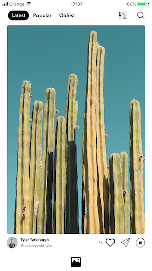

<h1 align="center">Youth</h1>

## About
Youth is application for iOS. It is exposed as an unoffial Unsplash Client.
It's developed in free time. 

#### What does the application offer?

- Beautiful, free, unlimited photos 🎉
- Sort photos by latest, popular, oldest
- Search photos
- See photographers
- Download and save photos

## 🔥 Features

- The application is divided into three main layers: `Presentation`, `Business Logic` and `Core`.
- The `Presentation` layer is built using [VIPER architecture](https://github.com/rambler-digital-solutions/The-Book-of-VIPER).
- The `Business Logic` layer is built using SOA.
- The `Core` layer is built using compound operations concept.
- Photo Downloader (download, cancel, save)
- Cool UI Design 😅
- Almost everywhere is used [Unsplash API](https://unsplash.com/documentation).

## 🚀 Getting Started
1. Clone the repository.
2. Run `pod install` to install dependencies. If you don't know what mean Cocoapods, see [Cocoapods](https://cocoapods.org/).

## 🛠 Setup

1. If you don't have developer account on [Unsplash Developers](https://unsplash.com/developers), please create.
2. Change Unsplash Constants on yours, `Youth -> Classes -> Core Layer -> Constants -> UnsplashConstants.swift.` ! No need to change redirectURI property !

#### ! Please, don't use my Unsplash Client ID and Client Secret, cause requests is limited ! Create yours.

## 👨🏻‍💻 To Do
- [x] Add CI
- [ ] Change icons (i think, can be better 😊)
- [x] Apply for production Unsplash Developers. Will increase number of requests to 5000 per hour. Now is 50 per hour. (They rejected me, because this app reproduce most of core functionality of their app 😬)
- [ ] Add persistance layer
- [ ] Add collections, see [Collections](https://unsplash.com/explore/collections)
- [ ] Add user login / logout + like / unlike + Me Profile
- [ ] Add photo viewer + filters

## ❤️ Contributing
I intend for this project to be more as an educational resource, learn by open sourcing. 

I am very open for feedback and contribution. 🤙

## 🐵 Author

Cristian Lupu

Email: cristian.lupu@ellation.com, lupucristiancptc@gmail.com

Twitter: [@LupuCrist](https://twitter.com/LupuCrist)

## 📚 License

Youth is available under the GPLv2 (or later) and the MPLv2 license.

See [COPYING](COPYING) for more license info.
